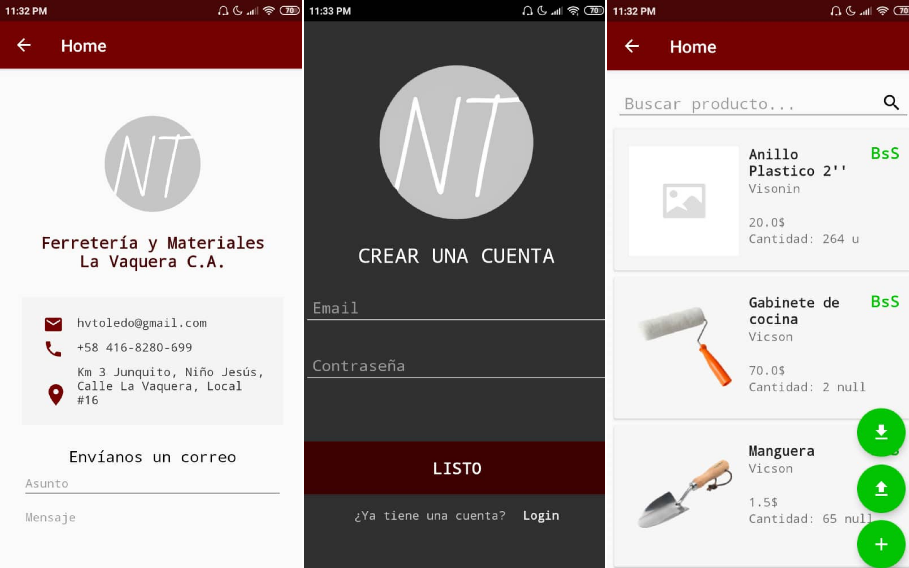

# La Vaquera Ferreteria Control
### _Store inventory management_



The _La Vaquera Ferreteria Control_ app is an Android mobile application that allows admin users to update, delete, and add products. It also displays the inventory, letting potential customers see the products' prices, categories, brands, and availability. It was built to administer and promote a local hardware store. 

- The app is in Spanish
- Sign in and Sign up forms
- Currency converter
- Real-time searcher
- Activities to visualize and manage products (based on the user status and type) 

You can also:
- Contact the business owner via email

### Tech

The app uses different frameworks, languages, and tools to work properly. Main technologies:

* [Android Studio] - the official IDE for Google's Android operating system
* [Java] - object-oriented programming language
* [Cloud Firestore] - flexible, scalable database from Firebase and Google Cloud

### Installation
The La Vaquera Ferreteria Control app requires [Android Studio](https://developer.android.com/studio)  to run.

Clone this repository and import into Android Studio.

```
https://github.com/ahn-nath/ferreteriaControl.git
```
For more information on how to run the app on a real device or an emulator after importing it, follow this [tutorial](https://developer.android.com/training/basics/firstapp/running-app).

### Adittional 

If you would like to know more about the project and its functionalities:

| Resource | URL|
| ------ | ------ |
| First prototype | [Ferreteria App - Invision Studio][prototype] |


**Any feedback is always welcome!**

[//]: # (These are reference links used in the body of this note and get stripped out when the markdown processor does its job.)


   [Android Studio]: <https://developer.android.com/studio>
   [Java]: <https://www.java.com/>
   [Cloud Firestore]: <https://firebase.google.com/>

   [prototype]: <https://nathaly738285.invisionapp.com/public/share/VX194A57ZB>
 
